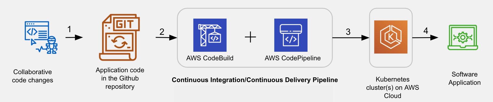

# Containerized Flask App Deployment to Kubernetes on AWS EKS

[](LICENSE)
[](https://github.com/EsraaKamel11/Containerized-Flask-App-Deployment-to-Kubernetes-on-AWS-EKS/issues)

This repository demonstrates how to:
- Run and containerize a Python Flask application locally.
- Deploy it to an Amazon EKS (Kubernetes) cluster.
- Set up IAM roles and configure RBAC for CodeBuild.
- Create a CI/CD pipeline using CodePipeline and CodeBuild integrated with GitHub.
- Automatically build, test, and deploy your application on new commits.

## Table of Contents

- [Project Overview](#project-overview)
- [Project ToDos](#project-todos)
- [Prerequisites](#prerequisites)
- [Initial Setup](#initial-setup)
- [Running the App Locally](#running-the-app-locally)
- [Containerizing the App Locally](#containerizing-the-app-locally)
- [Creating & Managing the EKS Cluster](#creating--managing-the-eks-cluster)
- [Setting up IAM Role for CodeBuild](#setting-up-iam-role-for-codebuild)
- [Authorizing CodeBuild via EKS RBAC](#authorizing-codebuild-via-eks-rbac)
- [Generating a GitHub Personal Access Token](#generating-a-github-personal-access-token)
- [Creating CodeBuild and CodePipeline Resources using CloudFormation](#creating-codebuild-and-codepipeline-resources-using-cloudformation)
- [How CodeBuild Knows the Build Steps](#how-codebuild-knows-the-build-steps)
- [Saving a Secret in AWS Parameter Store](#saving-a-secret-in-aws-parameter-store)
- [Testing Automatic Builds](#testing-automatic-builds)
- [Deploying to EKS (Manual Option)](#deploying-to-eks-manual-option)
- [Accessing the Application](#accessing-the-application)
- [Contribution Guidelines](#contribution-guidelines)
- [License](#license)

---
## Project Overview

The main objective is to create a CI/CD pipeline connecting your GitHub repository to your Amazon EKS cluster.



The diagram above shows the various stages of the Pipeline. The actions marked as 1, 2, 3, and 4 signify the following:

1. **Code Check-in:** Detect changes in your GitHub repo.
2. **Trigger Build:** Use CodeBuild to build a new Docker image and push it to ECR.
3. **Automatic Deployment:** Deploy the new image to your EKS cluster via CodePipeline.
4. **Service:** Serve application endpoints from the EKS cluster.

By the end, every code commit triggers an automated process that builds, tests, and deploys your application at scale.

---
## Project ToDos

**Part 1: Run the App Locally**
1. Familiarize yourself with the Flask application.
2. Containerize the app locally using Docker.

**Part 2: Run the App at Scale on AWS Cloud**
1. Create an EKS cluster and IAM role.
2. Generate a GitHub personal access token for CodeBuild.
3. Use a CloudFormation template to set up CodePipeline and CodeBuild.
4. Build, test, and deploy the application automatically on code changes.

---
## Prerequisites

- **Docker Desktop**
- **Git**
- **VS Code** (recommended)
- **AWS Account**
- **Python 3.7 - 3.9** and Pip (19.x or higher)
- **AWS CLI** configured (avoid `us-east-1`, use `us-east-2` recommended)
- **eksctl** and **kubectl**

Ensure all tools are installed and configured before proceeding.

---
## Initial Setup

### Fork and Clone the Repo

Fork the Server and Deployment Containerization Repo to your GitHub account. Then clone your forked repo locally:

```bash
git clone https://github.com/EsraaKamel11/Containerized-Flask-App-Deployment-to-Kubernetes-on-AWS-EKS.git
cd Containerized-Flask-App-Deployment-to-Kubernetes-on-AWS-EKS/
```

### Project Files

Relevant files for this project:

```plaintext
.
├── Dockerfile
├── aws-auth-patch.yml           # EKS Cluster configMap file
├── ci-cd-codepipeline.cfn.yml   # CloudFormation template to create CodePipeline & CodeBuild
├── buildspec.yml
├── simple_jwt_api.yml
├── trust.json                   # Used for creating an IAM role for CodeBuild
├── iam-role-policy.json
├── main.py
├── requirements.txt
└── test_main.py                 # Unit test file
```

Files to Modify:

- `trust.json`: Used with `iam-role-policy.json` to create an IAM role for CodeBuild.
- `aws-auth-patch.yml`: Sample file to guide you in creating a ConfigMap for EKS.
- `ci-cd-codepipeline.cfn.yml`: CloudFormation template to create CI/CD resources (you will set parameter values).
- `test_main.py`: Write or modify unit tests here.

---

## Overview - Flask App Endpoints

The Flask app provides three endpoints:

- **GET /**: Health check endpoint returning "Healthy".
- **POST /auth**: Accepts JSON with email and password, returns a JWT token.
- **GET /contents**: Requires a valid JWT and returns the decrypted token contents.

The app relies on an environment variable `JWT_SECRET` for JWT creation. Locally, you'll run using the Flask development server, but in production on EKS, you'll use Gunicorn for a production-ready environment.

---

### Steps to Run the App Locally

1. **Install Python Dependencies:**
   ```bash
   pip install -r requirements.txt
   ```

2. **Set Up Environment Variables:**
   ```bash
   export JWT_SECRET='myjwtsecret'
   export LOG_LEVEL=DEBUG
   ```

3. **Run the App:**
   ```bash
   python main.py
   ```
   Access the health check endpoint at `http://127.0.0.1:8080/`.

4. **Install jq (for JSON processing):**
   - Linux:
     ```bash
     sudo apt-get install jq
     ```
   - Mac:
     ```bash
     brew install jq
     ```
   - Windows (using Chocolatey):
     ```bash
     choco install jq
     ```

5. **Access `/auth` Endpoint:**
   ```bash
   export TOKEN=`curl --data '{"email":"abc@xyz.com","password":"mypwd"}' \
   --header "Content-Type: application/json" -X POST localhost:8080/auth | jq -r '.token'`
   echo $TOKEN
   ```

6. **Access `/contents` Endpoint:**
   ```bash
   curl --request GET 'http://localhost:8080/contents' \
   -H "Authorization: Bearer ${TOKEN}" | jq .
   ```

   **Note on PyJWT versions:** If you encounter `AttributeError: 'str' object has no attribute 'decode'`, ensure `pyjwt==1.7.1` is installed.

---

### Containerize the Flask App and Run Locally

1. **Check Dockerfile:**
   Ensure it has the correct base image, copies code to `/app`, installs dependencies, and runs the Gunicorn server on port 8080.

2. **Create `.env_file`:**
   ```plaintext
   JWT_SECRET='myjwtsecret'
   LOG_LEVEL=DEBUG
   ```

   Add `.env_file` to `.gitignore` to avoid committing secrets.

3. **Build Docker Image:**
   ```bash
   docker build -t myimage .
   ```

4. **Run the Container:**
   ```bash
   docker run --name myContainer --env-file=.env_file -p 80:8080 myimage
   ```
   Access at `http://localhost:80`.

5. **Test the Endpoints in the Container:**
   ```bash
   curl --request GET 'http://localhost:80/'
   
   # Auth endpoint
   export TOKEN=`curl --data '{"email":"abc@xyz.com","password":"WindowsPwd"}' \
   --header "Content-Type: application/json" -X POST localhost:80/auth | jq -r '.token'`
   echo $TOKEN
   
   # Contents endpoint
   curl --request GET 'http://localhost:80/contents' -H "Authorization: Bearer ${TOKEN}" | jq .
   ```

---

## Next Steps

After running the app locally and containerizing it, you'll move on to creating the EKS cluster, IAM roles, GitHub access tokens, and CodePipeline/CodeBuild resources using CloudFormation. Once everything is set up, every code commit will trigger an automatic build, test, and deployment process, enabling rapid and reliable updates to your application in a production-like Kubernetes environment.

---

# Creating & Managing the EKS Cluster

## Create an EKS Cluster

Create an EKS cluster named `simple-jwt-api` in a chosen region (e.g., `us-west-2`):

```bash
eksctl create cluster --name simple-jwt-api --nodes=2 --version=1.30 --instance-types=t2.medium --region=us-west-2
```
`Note - You must use a kubectl version within one minor version difference of your Amazon EKS cluster control plane. For example, a 1.21 kubectl client works with Kubernetes 1.20, 1.21, and 1.22 clusters.`

### Verify Cluster Nodes

Check the health of your cluster’s nodes:

```bash
kubectl get nodes
```
.png)

## Delete when the Project is over

```bash
eksctl delete cluster simple-jwt-api  --region=us-west-2
```
---

## Setting up IAM Role for CodeBuild

### Create the IAM Role

Get your AWS account ID:

```bash
aws sts get-caller-identity --query Account --output text
```

Update the `trust.json` file with your AWS account ID:

```json
{
  "Version": "2012-10-17",
  "Statement": [
    {
      "Effect": "Allow",
      "Principal": {
        "AWS": "arn:aws:iam::<ACCOUNT_ID>:root"
      },
      "Action": "sts:AssumeRole"
    }
  ]
}
```

(Replace `<ACCOUNT_ID>` with your actual AWS account ID.)

Create the role `FlaskDeployCBKubectlRole`:

```bash
aws iam create-role \
  --role-name FlaskDeployCBKubectlRole \
  --assume-role-policy-document file://trust.json \
  --output text \
  --query 'Role.Arn'
```

### Attach IAM Policy

Attach the provided policy (`iam-role-policy.json`) to the role:

`iam-role-policy.json`:

```json
{
 "Version": "2012-10-17",
 "Statement": [
     {
         "Effect": "Allow",
         "Action": [
             "eks:Describe*",
             "ssm:GetParameters"
         ],
         "Resource": "*"
     }
 ]
}
```

Attach the policy:

```bash
aws iam put-role-policy \
  --role-name FlaskDeployCBKubectlRole \
  --policy-name eks-describe \
  --policy-document file://iam-role-policy.json
```

---

## Authorizing CodeBuild via EKS RBAC

### Fetch `aws-auth` ConfigMap

```bash
# Mac/Linux - file saved to /System/Volumes/Data/private/tmp/aws-auth-patch.yml
kubectl get -n kube-system configmap/aws-auth -o yaml > /tmp/aws-auth-patch.yml

# Windows - file saved to current directory
kubectl get -n kube-system configmap/aws-auth -o yaml > aws-auth-patch.yml
```

### Edit & Patch `aws-auth` ConfigMap

Open the fetched file in your editor:

```bash
# Mac/Linux
code /System/Volumes/Data/private/tmp/aws-auth-patch.yml

# Windows
code aws-auth-patch.yml
```

Add the following under `data.mapRoles`: (ensure correct indentation):

```yaml
  - groups:
      - system:masters
    rolearn: arn:aws:iam::<ACCOUNT_ID>:role/FlaskDeployCBKubectlRole
    username: build
```

Patch your cluster’s configmap:

```bash
# Mac/Linux
kubectl patch configmap/aws-auth -n kube-system --patch "$(cat /tmp/aws-auth-patch.yml)"

# Windows
kubectl patch configmap/aws-auth -n kube-system --patch "$(cat aws-auth-patch.yml)"
```

---

## Generating a GitHub Personal Access Token

1. Go to **GitHub Settings > Developer settings > Personal access tokens**.
2. Click **Generate new token**.
3. Name the token (e.g., `EKS-Deployment-Token`).
4. Under **Select scopes**, select `repo` (Full control of private repositories).
5. Generate the token and copy it immediately. Store it securely.

This token will be used by CodePipeline to access your GitHub repo and trigger builds when you push changes.

---

# Creating CodeBuild and CodePipeline Resources using CloudFormation

## Modify the CloudFormation Template

You have been provided a CloudFormation template file named `ci-cd-codepipeline.cfn.yml` in your starter repository. This template is used to create the CodePipeline pipeline and the CodeBuild project that will integrate your GitHub repository with your EKS cluster.

### Steps to Modify the Template

1. **Open the Template:**  
   Navigate to your local copy of the repository and open `ci-cd-codepipeline.cfn.yml` in your preferred code editor.

2. **Locate the Parameters Section:**  
   Within `ci-cd-codepipeline.cfn.yml`, find the `Parameters` section. This section lists variables that CloudFormation will prompt you for when creating the stack.

3. **Set the Parameter Values:**  
   Update the parameters to match the values you used when creating your EKS cluster and your GitHub repository details:

   | Parameter       | Value                            | Description                                          |
   |-----------------|----------------------------------|------------------------------------------------------|
   | EksClusterName  | `simple-jwt-api`                 | The name of the EKS cluster you created earlier.     |
   | GitSourceRepo   | `Containerized-Flask-App-Deployment-to-Kubernetes-on-AWS-EKS` | Your GitHub repository name.                         |
   | GitBranch       | `master` (or your chosen branch) | The branch of your GitHub repo to integrate with the pipeline. |
   | GitHubUser      | `<YOUR_GITHUB_USERNAME>`          | Your GitHub username.                                |
   | KubectlRoleName | `FlaskDeployCBKubectlRole`       | The IAM role you created previously for CodeBuild/Kubectl access. |

**Example Parameter Section Snippet:**

```yaml
Parameters:
  EksClusterName:
    Type: String
    Default: simple-jwt-api
    Description: "Name of your EKS Cluster"
  GitSourceRepo:
    Type: String
    Default: Containerized-Flask-App-Deployment-to-Kubernetes-on-AWS-EKS
    Description: "Github Repository Name"
  GitBranch:
    Type: String
    Default: master
    Description: "The Git branch to use (e.g. master)"
  GitHubUser:
    Type: String
    Default: <YOUR_GITHUB_USERNAME>
    Description: "Your GitHub username"
  KubectlRoleName:
    Type: String
    Default: FlaskDeployCBKubectlRole
    Description: "The IAM Role for CodeBuild to run kubectl"
```
---

## Review the Resources

The `ci-cd-codepipeline.cfn.yml` will create:

- An ECR repository for your Docker image.
- An S3 bucket for pipeline artifacts.
- Several IAM roles for the services.
- A Lambda function.
- CodeBuild and CodePipeline resources.

---

## Create the Stack

Use the AWS Management Console to create a stack from the `ci-cd-codepipeline.cfn.yml` template:

1. Go to the CloudFormation console and click **Create Stack**.
2. Under "Specify template", choose **Template is ready** and **Upload a template file**, then upload your `ci-cd-codepipeline.cfn.yml`.

.png)

3. Click **Next**, then specify stack details:
   - Enter a Stack Name.
   - Enter the GitHub access token generated earlier.
   - Make sure the GitHub repo name, IAM role, and EKS cluster name match those created earlier.

.png)

4. Click **Next** for "Configure stack options" and leave defaults.
5. Click **Create stack**.
6. Wait for the stack creation to complete (5-15 minutes). After successful creation, you’ll see CodeBuild and CodePipeline resources along with an S3 bucket, Lambda function, and other supporting resources.

`Troubleshoot`
If there is an indentation error in your YAML template file, the CloudFormation will raise a "Template format error". In such a case, you will have to identify the line of error in the template, using any external tools, such as - YAML Validator or YAML Lint.
---

## Saving a Secret in AWS Parameter Store

Your application needs a secret text string for JWT creation. You’ll use AWS Parameter Store to store this secret.

### Set the Secret

```bash
aws ssm put-parameter --name JWT_SECRET --overwrite --value "myjwtsecret" --type SecureString
```

### Verify the Secret

```bash
aws ssm get-parameter --name JWT_SECRET
```

### Delete the Secret (if needed)

```bash
aws ssm delete-parameter --name JWT_SECRET
```
---

## How Does CodeBuild Know the Build Steps?

The CloudFormation template creates a CodeBuild resource. CodeBuild uses `buildspec.yml` to determine the build steps.

### Buildspec Details

1. Place the `buildspec.yml` file at the root of your source directory.
2. Update the `kubectl` version in `buildspec.yml` to match or be within one minor version of your EKS cluster control plane version (e.g., if EKS is 1.22, use kubectl 1.21, 1.22, or 1.23).
3. Ensure the following code is present at the end of the `buildspec.yml` file:

```yaml
env:
  parameter-store:         
    JWT_SECRET: JWT_SECRET
```

This sets an environment variable in CodeBuild from the value in Parameter Store.

#### Phases of `buildspec.yml`:

- **install phase:**
  Installs Python, pip, and kubectl, and updates the system path so all required tools are available.

- **pre-build phase:**
  Logs into the ECR repository where the Docker image will be pushed.

- **build phase:**
  Builds the Docker image using the provided `Dockerfile` and tags it with the proper repository and version.

- **post-build phase:**
  Pushes the Docker image to ECR.
  Updates the EKS kubeconfig and applies Kubernetes manifests to update the deployment.

### Triggering Builds

You cannot manually trigger builds directly from the CodeBuild console because the project uses CodePipeline artifacts. A manual build attempt will result in an error:

> Build failed to start. The following error occurred: ArtifactsOverride must be set when using artifacts type CodePipelines

**Workaround:**
Use the CodePipeline console to trigger a build by clicking the **"Release change"** button.

### Testing Automatic Builds

1. **Check Your Remote:**
   Ensure your local repository is connected to your GitHub fork.

   ```bash
   git remote -v
   ```

2. **Make Changes Locally:**

   ```bash
   git status
   git add <filename>
   git commit -m "Your meaningful commit message"
   git push
   ```

3. **Verify the Build:**
   Go to the CodePipeline console. The pipeline should automatically trigger, run the build, and deploy changes to your EKS cluster.

.png)

---

## Accessing the Application

```bash
kubectl get svc
```

Find the `EXTERNAL-IP` from the LoadBalancer service and access the app at `http://<EXTERNAL-IP>:<PORT>`.

---

## Contribution Guidelines

Contributions are welcome!

1. Open an issue to discuss changes.
2. Fork the repo and create a feature branch.
3. Submit a Pull Request.

---

## License

This project is licensed under the MIT License.
